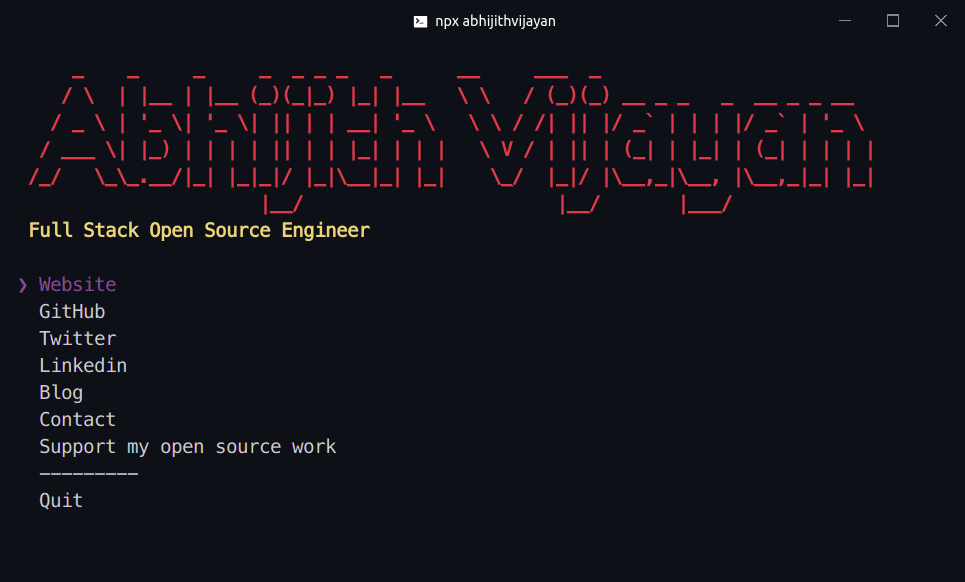

# abhijithvijayan [](https://travis-ci.org/abhijithvijayan/abhijithvijayan)

> The [Abhijith Vijayan](https://abhijithvijayan.in) CLI



## Usage

Install [Node.js](https://nodejs.org/), then:

```
$ npx abhijithvijayan
```

## Inspiration

[Sindre Sorhus](https://github.com/sindresorhus)

## License

MIT © [Abhijith Vijayan](https://abhijithvijayan.in)
