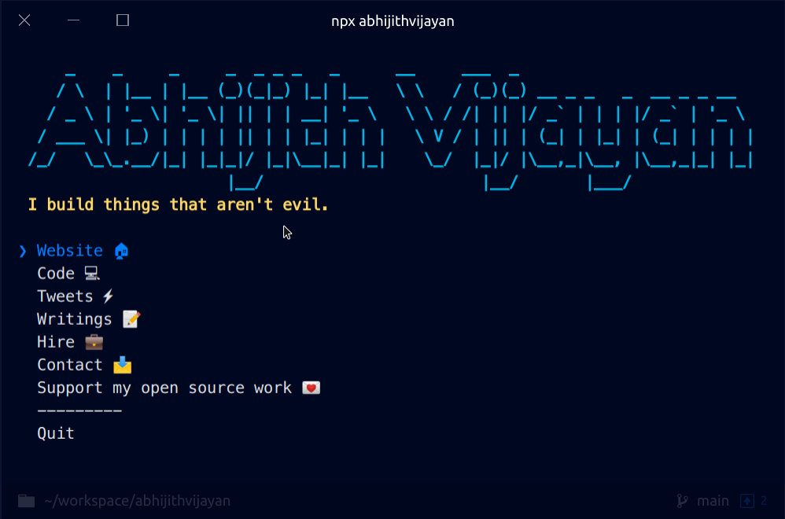

<h1 align="center">abhijithvijayan</h1>
<p align="center">The <a href="https://abhijithvijayan.in">
    Abhijith Vijayan
  </a> CLI</p>
<div align="center">
  <a href="https://www.npmjs.com/package/abhijithvijayan">
    
  </a>
  <a href="https://travis-ci.com/abhijithvijayan/abhijithvijayan">
    
  </a>
  </a>
  <a href="https://david-dm.org/abhijithvijayan/abhijithvijayan">
    
  </a>
  <a href="https://github.com/abhijithvijayan/abhijithvijayan/blob/main/license">
    
  </a>
  <a href="https://twitter.com/intent/tweet?text=Check%20out%20CLI%20of%20%40_abhijithv%0A%0Ahttps%3A%2F%2Fgithub.com%2Fabhijithvijayan%2Fabhijithvijayan%0A%0A%23npm%20%23cli%20%23javascript%20%23opensource">
     
  </a>
</div>
<h3 align="center">🙋‍♂️ Made by <a href="https://twitter.com/_abhijithv">@abhijithvijayan</a></h3>
<p align="center">
  Donate:
  <a href="https://www.paypal.me/iamabhijithvijayan" target='_blank'><i><b>PayPal</b></i></a>,
  <a href="https://www.patreon.com/abhijithvijayan" target='_blank'><i><b>Patreon</b></i></a>
</p>
<p align="center">
  <a href='https://www.buymeacoffee.com/abhijithvijayan' target='_blank'>
    
  </a>
</p>
<hr />



❤️ it? ⭐️ it on [GitHub](https://github.com/abhijithvijayan/abhijithvijayan/stargazers) or [Tweet](https://twitter.com/intent/tweet?text=Check%20out%20CLI%20of%20%40_abhijithv%0A%0Ahttps%3A%2F%2Fgithub.com%2Fabhijithvijayan%2Fabhijithvijayan%0A%0A%23npm%20%23cli%20%23javascript%20%23opensource) about it.

## Table of Contents

- [Installation](#installation)
- [Issues](#issues)
  - [🐛 Bugs](#-bugs)
- [LICENSE](#license)

## Installation

Ensure you have [Node.js](https://nodejs.org) 10 or later installed. Then run the following:

```
npx abhijithvijayan
```

## Issues

_Looking to contribute? Look for the [Good First Issue](https://github.com/abhijithvijayan/abhijithvijayan/issues?q=is%3Aissue+is%3Aopen+sort%3Aupdated-desc+label%3A%22good+first+issue%22)
label._

### 🐛 Bugs

Please file an issue [here](https://github.com/abhijithvijayan/abhijithvijayan/issues/new) for bugs, missing documentation, or unexpected behavior.

[**See Bugs**](https://github.com/abhijithvijayan/abhijithvijayan/issues?q=is%3Aissue+is%3Aopen+sort%3Aupdated-desc+label%3A%22type%3A+bug%22)

### Linting Config

- Shared Eslint & Prettier Configuration - [`@abhijithvijayan/eslint-config`](https://www.npmjs.com/package/@abhijithvijayan/eslint-config)

### Credits

[Sindre Sorhus](https://github.com/sindresorhus)

## License

MIT © [Abhijith Vijayan](https://abhijithvijayan.in)
