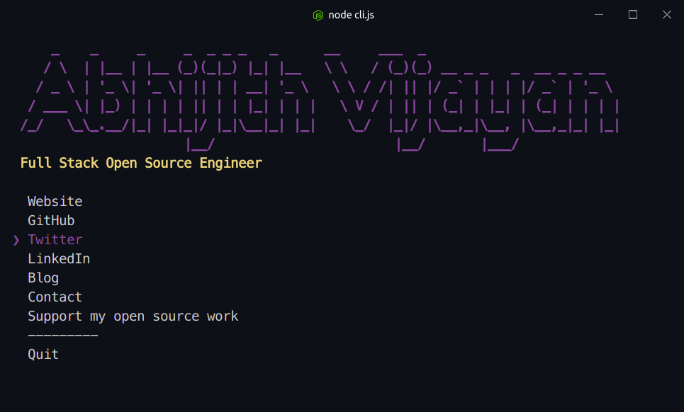

# abhijithvijayan [](https://travis-ci.org/abhijithvijayan/abhijithvijayan)

> The [Abhijith Vijayan](https://abhijithvijayan.in) CLI

<h3>🙋‍♂️ Made by <a href="https://twitter.com/_abhijithv">@abhijithvijayan</a></h3>
<p>
  Donate:
  <a href="https://www.paypal.me/iamabhijithvijayan" target='_blank'><i><b>PayPal</b></i></a>,
  <a href="https://www.patreon.com/abhijithvijayan" target='_blank'><i><b>Patreon</b></i></a>
</p>
<p>
  <a href='https://www.buymeacoffee.com/abhijithvijayan' target='_blank'>
    
  </a>
</p>
<hr />



## Usage

Install [Node.js](https://nodejs.org/) 10 or later, then run

```
$ npx abhijithvijayan
```

## Inspiration

[Sindre Sorhus](https://github.com/sindresorhus)

## License

MIT © [Abhijith Vijayan](https://abhijithvijayan.in)
